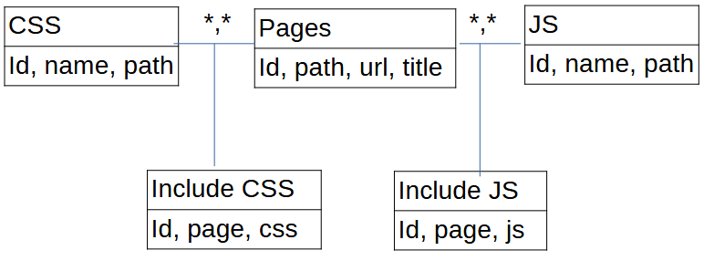

# Galleries
Site web permettant de naviguer dans une galleries d'image.
Il est possible de filtrer les images par format (Portrait, paysage, autre), évaluation (beau, médiocre ...), nom, dossier, possibilité de passer en plein écran ...

Les images peuvent être stocké n'importe où (voire section Dépendance)

# Dépendances
- Nécéssite un fichier .htaccess à la racine
```
RewriteEngine On
RewriteRule ^([a-zA-Z0-9\-\_\/]*)$ index.php?url=$1
```

- Nécéssite una base sql pour gérer les dépendances des pages web (pour les fichier css et js), selon le shéma suivant
  
  
- Nécessite une base sql contenant les chemins d'accés vers toutes les images de la gallerie selon le shéma
  id, path, name, type, category, fullscreen
